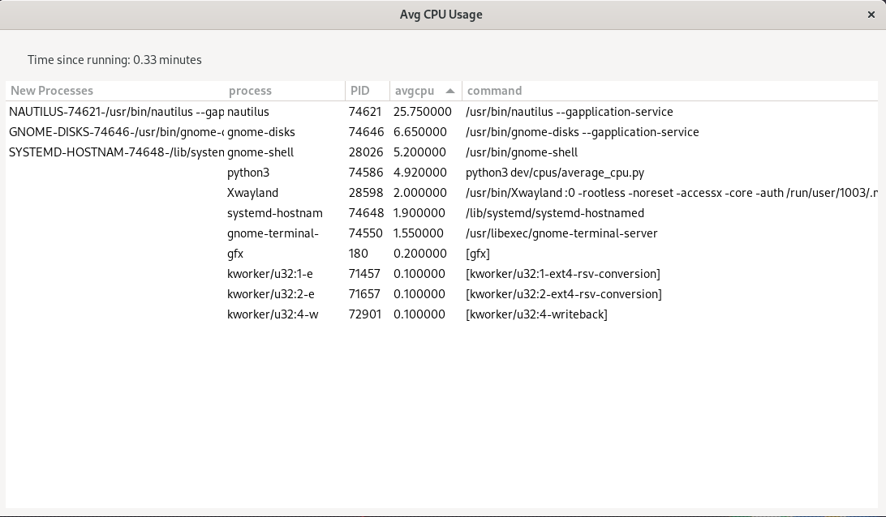

## Average CPU usage

Desktop app that measures average CPU usage and uses rolling window to check for new processes and outputs all values in table:



### Colum names and descriptions:
1. new processes - rolling window checks for new processes
2. process - process name
3. PID - process id
4. avgcpu - average cpu usage
5. command - command associated with process

Additional label shows time since program started running.

To run, make sure your environment is setup, check [https://pygobject.gnome.org/getting_started.html](https://pygobject.gnome.org/getting_started.html)

example command to run app: ```python3 average-cpu.py```

Made with python and [pyGObject](https://pygobject.gnome.org/)


